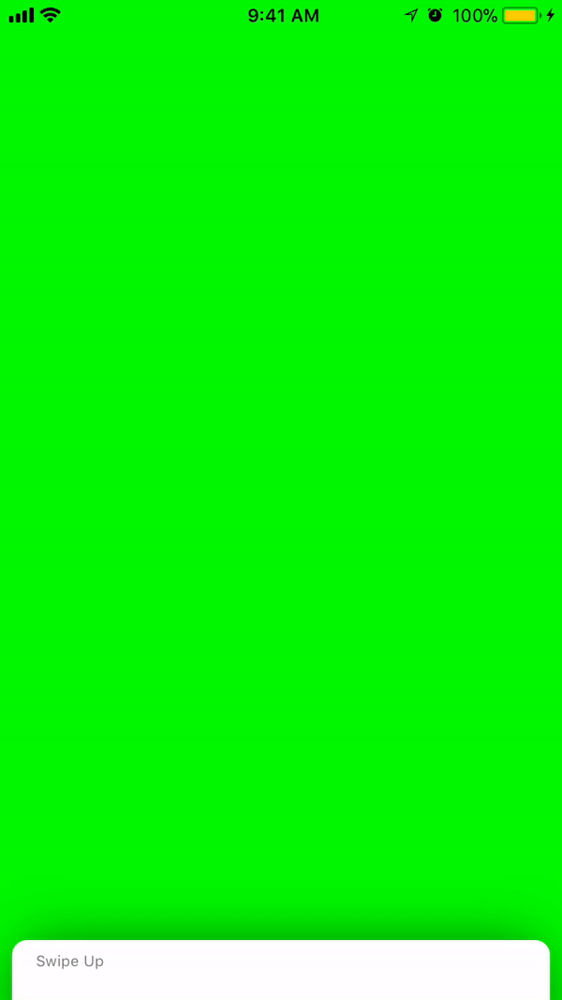
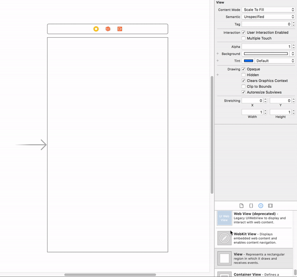

## Overview


## Requirements
* Xcode 9+
* Swift 4

## Usage

### Storyboard


### Code
```
import UIKit
import Peekaboo

class ViewController: UIViewController {
    let peekingView = Peekboo()

    override func viewDidLoad() {
        super.viewDidLoad()

        self.view.addSubview(peekingView) // Alignment is done for you
    }

}
```


